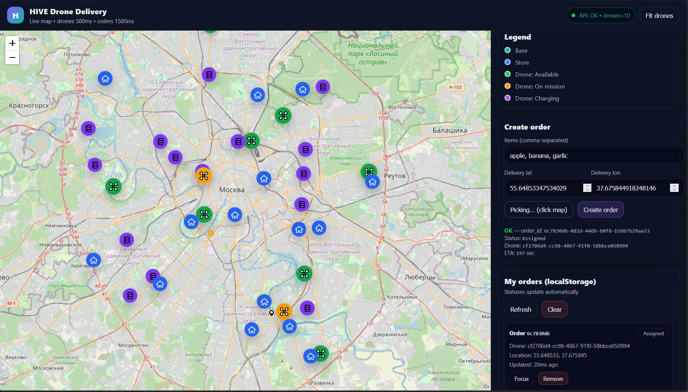
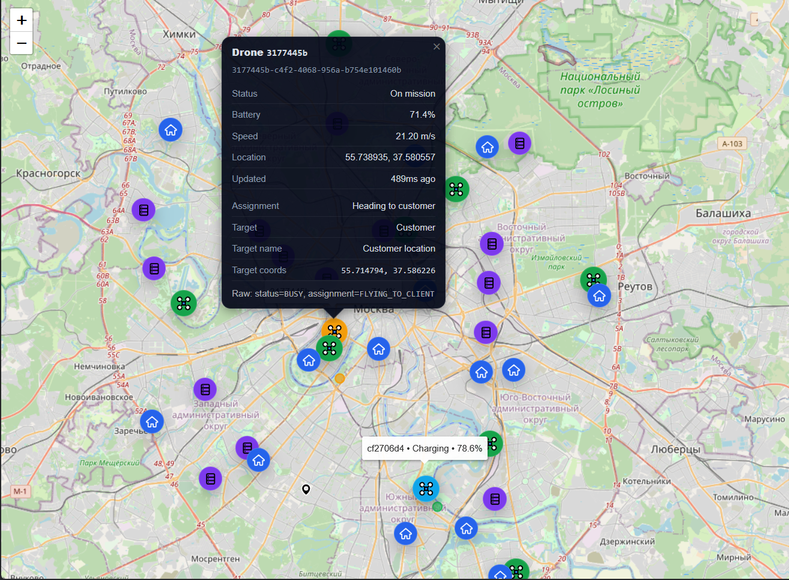

# Drone Delivery Platform

[Изначальная архитектура проекта в ExcalidDraw](https://excalidraw.com/#json=UyeMlv9V4wQKOuthpubgd,X1H_Zg0GTbg-xaFboX-exA)

Микросервисный проект, демонстрирующий архитектуру системы автоматической доставки заказов дронами.
Проект моделирует полный цикл доставки: создание заказа, подбор ближайшего даркстора и дрона, назначение, полёт,
телеметрию, обработку событий и завершение доставки.




---

## Общая идея

Пользователь оформляет заказ через веб-интерфейс.
HTTP-запрос поступает в API Gateway, где создаётся заказ и инициируется назначение дрона:

* дрон подключается по gRPC stream,
* телеметрия публикуется в Kafka,
* Dispatch обрабатывает события и управляет состоянием доставки,
* Tracking отвечает за поиск и состояние дронов,
* Store и Base предоставляют геоданные инфраструктуры.

---

## Архитектура

### Общая схема взаимодействия

```
Frontend
   |
   v
Nginx
   |
   v
API Gateway (HTTP /api/v1)
   |
   +--> Order (gRPC, PostgreSQL)
   |        |
   |        v
   |     Dispatch (gRPC, PostgreSQL, Kafka consumer)
   |        |
   |        v
   |     Telemetry (gRPC stream, Kafka producer)
   |
   +--> Tracking (gRPC, Redis GEO, Kafka consumer)
   +--> Store (gRPC, Redis GEO)
   +--> Base (gRPC, Redis GEO)
```

---

## Технологический стек

### Frontend

* HTML (index.html)
* JavaScript (api.js)
* CSS (style.css)
* Leaflet
* OpenStreetMap

### Backend

* Go 1.25.5
* gRPC
* Echo v4
* Kafka
* Redis (Geo)
* PostgreSQL
* Docker
* Docker Compose
* Nginx

---

## Сервисы

### API Gateway

HTTP-интерфейс для клиента.

* Framework: echo/v4
* Base path: /api/v1

Методы:

* GET /ping
* POST /orders
* GET /orders/:id
* GET /bases
* GET /stores
* GET /drones

---

### Order Service

Управление заказами.

* gRPC
* PostgreSQL

Методы:

* CreateOrder
* GetOrder
* UpdateStatus

[Протофайл](proto/order.proto)

---

### Dispatch Service

Назначение дронов и управление доставкой.

* gRPC
* Kafka consumer
* PostgreSQL

Методы:

* AssignDrone
* GetAssignment

[Протофайл](proto/dispatch.proto)

---

### Telemetry Service

Связь с дронами и телеметрия.

* gRPC streaming
* Kafka producer

Методы:

* Link (stream)
* SendCommand

[Протофайл](proto/telemetry.proto)

---

### Tracking Service

Поиск и состояние дронов.

* gRPC
* Redis GEO
* Kafka consumer

Методы:

* FindNearest
* GetDroneLocation
* SetStatus
* ListDrones

[Протофайл](proto/tracking.proto)

---

### Store Service

Дарксторы (хранилища товаров).

* gRPC
* Redis GEO

Методы:

* CreateStore
* GetStoreLocation
* ListStores
* FindNearest

[Протофайл](proto/store.proto)

---

### Base Service

Базы дронов.

* gRPC
* Redis GEO

Методы:

* CreateBase
* GetBaseLocation
* ListBases
* FindNearest

[Протофайл](proto/base.proto)

---

## Telemetry Emulator

Эмулятор дронов, отправляющий телеметрию в Telemetry Service.

* gRPC streaming
* Настраиваемые данные: 
  * Количество дронов
  * Скорость полёта
  * Расход батареи
  * Частота отправки телеметрии

---

## Kafka

Kafka используется для асинхронного обмена событиями между сервисами.

Основные топики:

* telemetry-data
* telemetry-events

Telemetry публикует события и данные дронов.
Dispatch и Tracking подписываются на топики и обновляют состояние системы.

---

## Хранилища данных

### PostgreSQL

Используется для хранения бизнес-сущностей.

Таблица orders:

```
CREATE TABLE IF NOT EXISTS orders (
    id TEXT PRIMARY KEY,
    user_id TEXT NOT NULL,
    drone_id TEXT,
    items TEXT[] NOT NULL,
    status TEXT NOT NULL,
    delivery_lat DOUBLE PRECISION NOT NULL,
    delivery_lon DOUBLE PRECISION NOT NULL,
    created_at TIMESTAMPTZ NOT NULL DEFAULT now(),
    updated_at TIMESTAMPTZ NOT NULL DEFAULT now()
);
```

Таблица assignments:

```
CREATE TABLE IF NOT EXISTS assignments (
    id TEXT PRIMARY KEY,
    order_id TEXT NOT NULL,
    drone_id TEXT NOT NULL,
    status TEXT NOT NULL,
    target_lat DOUBLE PRECISION NULL,
    target_lon DOUBLE PRECISION NULL,
    created_at TIMESTAMPTZ NOT NULL DEFAULT NOW(),
    updated_at TIMESTAMPTZ NOT NULL DEFAULT NOW()
);
```

Базы данных создаются автоматически при старте PostgreSQL контейнера:

* order
* dispatch

---

### Redis

Используется как in-memory хранилище с GEO-индексами:

* координаты дронов,
* координаты дарксторов,
* координаты баз.

---

## Nginx

Nginx используется как единая точка входа в систему.

Функции:

* отдача frontend-статических файлов,
* проксирование HTTP API Gateway,
* health-check эндпоинты,
* поддержка upgrade-заголовков,
* keepalive соединения.

### Основные маршруты

* / — frontend (index.html)
* /api/* — проксирование в API Gateway
* /health — health-check API Gateway
* /nginx/health — health-check Nginx

### Поведение

* Frontend доступен по [http://localhost](http://localhost)
* API доступен по [http://localhost/api/v1](http://localhost/api/v1)
* Настроены таймауты, retry и keepalive для upstream API Gateway

---

## Docker Compose

Проект полностью запускается через Docker Compose.

Состав окружения:

* nginx
* api-gateway
* order + migrate
* dispatch + migrate
* telemetry
* telemetry-emulator
* tracking + kafka worker
* base + migrate + generate
* store + migrate + generate
* postgres
* redis
* zookeeper
* kafka
* kafka-init

Зависимости между сервисами описаны через depends_on и healthcheck.

---

## Запуск проекта

### Требования

* Docker
* Docker Compose

### Запуск

```bash
docker compose up --build -d
```

### Проверка

```bash
# Nginx
curl http://localhost/nginx/health

# API
curl http://localhost/api/v1/ping
```

---

## Kubernetes (production rollout)

Для production-развертывания добавлен hardening-блок в `infra/k8s`:

* readiness/liveness/startup probes (HTTP и gRPC health),
* `securityContext` (non-root, seccomp, drop capabilities, read-only root filesystem),
* `resources` requests/limits,
* migration/init `Job` для order, dispatch, base и store,
* базовый `Ingress` для API Gateway.

Перед запуском:

1. Сконфигурируйте образы в `infra/k8s/*.yaml` (по умолчанию стоят placeholder-значения `ghcr.io/your-org/...`).
2. Обновите `infra/k8s/configmap.yaml` под ваше окружение (домен, Kafka/Redis/PostgreSQL endpoints, CORS).
3. Заполните `infra/k8s/secret.yaml` реальными секретами.

Применение:

```bash
# базовые ресурсы
kubectl apply -f infra/k8s/namespace.yaml
kubectl apply -f infra/k8s/configmap.yaml
kubectl apply -f infra/k8s/secret.yaml

# миграции (дождаться завершения каждого Job)
kubectl apply -f infra/k8s/jobs.yaml
kubectl wait --for=condition=complete job/order-migrate -n hive --timeout=180s
kubectl wait --for=condition=complete job/dispatch-migrate -n hive --timeout=180s
kubectl wait --for=condition=complete job/base-migrate -n hive --timeout=180s
kubectl wait --for=condition=complete job/store-migrate -n hive --timeout=180s

# приложения и ingress
kubectl apply -f infra/k8s/order.yaml
kubectl apply -f infra/k8s/dispatch.yaml
kubectl apply -f infra/k8s/base.yaml
kubectl apply -f infra/k8s/store.yaml
kubectl apply -f infra/k8s/tracking.yaml
kubectl apply -f infra/k8s/telemetry.yaml
kubectl apply -f infra/k8s/api-gateway.yaml
kubectl apply -f infra/k8s/pdb.yaml
kubectl apply -f infra/k8s/ingress.yaml
```

Проверка:

```bash
kubectl get pods -n hive
kubectl get svc -n hive
kubectl get ingress -n hive
```

Примечание: `telemetry` в манифесте зафиксирован в `replicas: 1`, потому что активные drone stream-соединения хранятся в памяти процесса.

---

## Frontend

Frontend расположен в каталоге frontend/.

Функции:

* создание заказа,
* получение состояния заказа,
* отображение дронов и инфраструктуры,
* визуализация на карте OpenStreetMap.

Frontend реализован без фреймворков и служит демонстрацией взаимодействия с HTTP API.

---

## OpenAPI

HTTP API Gateway описан спецификацией [OpenAPI 3.0](services/api-gateway/openapi.yml) и полностью соответствует DTO, используемым в сервисе.

Спецификация может быть использована для генерации клиента или Swagger UI.

---

## Планы на будущее

* Добавление аутентификации и авторизации пользователей.
* Интеграция с реальными картографическими сервисами.
* Определение точки заказа по адресу.
* Добавление каталога товаров и управление корзиной.
* Реализация более сложной логики назначения дронов.
